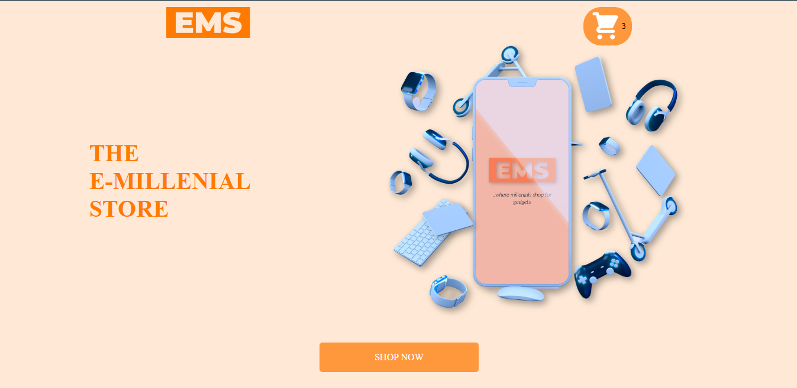

# THE E-MILLENIAL STORE
An E-commerce website with payment via [Stripe](https://stripe.com/) (A Gadgets Store)
This is a [React.js](https://reactjs.org/) project bootstrapped with [`create-react-app`](https://create-react-app.dev/docs/getting-started/).

## Table of contents

- [Overview](#overview)
  - [The challenge](#the-challenge)
  - [Screenshot](#screenshot)
  - [Links](#links)
- [My process](#my-process)
  - [Built with](#built-with)
  - [What I learned](#what-i-learned)
  - [Useful resources](#useful-resources)

## Overview

### The challenge

Users should be able to:

- View the optimal layout for the site depending on their device's screen size
- Search for items
- view results
- Add, update and remove from cart
- Make payments for items with stripe payments
- Navigate to the cart page

### Screenshot




### Links

- Solution URL: (https://github.com/faozziyyah/E-Millenial-store)
- Live Site URL: (https://faozziyyah.github.io/E-Millenial-store/)

## My process
### Built with

- CSS
- [React-bootstrap](https://react-bootstrap.github.io/) - React Bootstrap: CSS framework
- [React](https://reactjs.org/) - React: JS library

### What I learned

- React Bootstrap
- Stripe payment integration

```React.js
<Dropdown.Toggle className={styles.cart}>
    
    <Badge>{cart.length}</Badge>
</Dropdown.Toggle>
```
```React.js
<StripeCheckout
    className={styles.checkoutbutton}
    label='Pay Now'
    name='Gadgets Store.'
    billingAddress
    shippingAddress
    description={`Your total is $${price}`}
    amount={priceForStripe}
    panelLabel='Pay Now'
    token={onToken}
    allowRememberMe
    stripeKey={publishableKey}
/>

<StripeButton price={total} />
```

### Useful resources
- [React-bootstrap](https://react-bootstrap.github.io/) - React Bootstrap: CSS framework
- [React](https://reactjs.org/) - React: JS library
- [Stripe](https://stripe.com/) Payment processing platform

